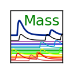

Mass
======

.. toctree::
   :maxdepth: 2
   :caption: Contents:

   off_style
   gamma
   hci_lines_from_asd
   xray_efficiency_models
   line_fitting

..

Hand written documentation (mostly old style mass)
--------------------------------------------------
.. toctree::
   :maxdepth: 2
   :caption: Contents:

   cuts_md
   autocal
   Demos
   hdf5_only
   invert_pulses
   set_chan_bad
   tests
   fluorescence
   LJHfiles.md

Key Classes Autogenerated Docs
------------------------------
.. toctree::
   :maxdepth: 2
   :caption: Contents:

   manual_autodoc

Bulk Autogenerated Docs
-----------------------
.. toctree::
   :maxdepth: 2
   :caption: Contents:

   mass.core
   mass.calibration

Indices and tables
------------------
* :ref:`genindex`
* :ref:`modindex`
* :ref:`search`
